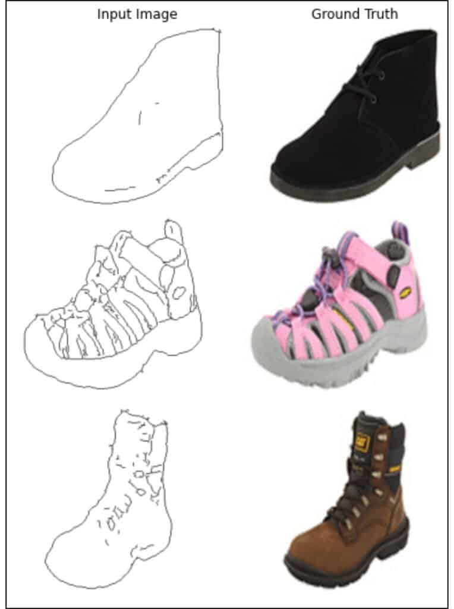
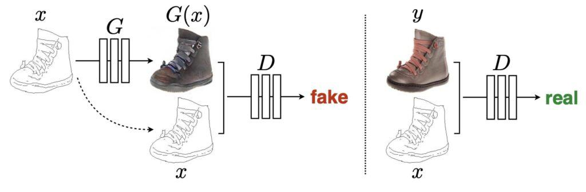
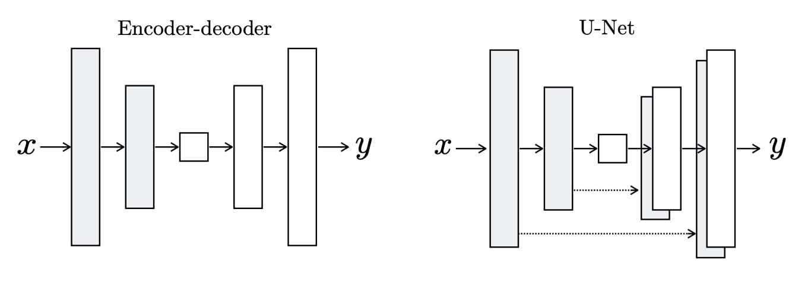
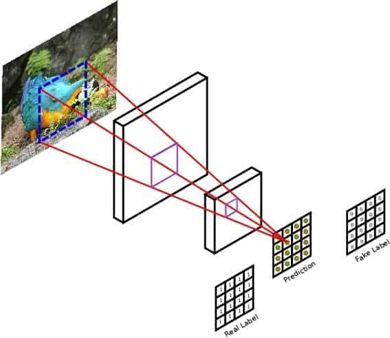

# pix2pix-gan

[Image-to-Image Translation with Conditional Adversarial Networks](https://arxiv.org/pdf/1611.07004.pdf)

## Dataset

Input: Paired Image

[edges2portrait](https://www.kaggle.com/datasets/kairess/edges2portrait)

## Pix2Pix GAN

### Generator

UNet with skip connection

Source

### Discriminator

Patch GAN

